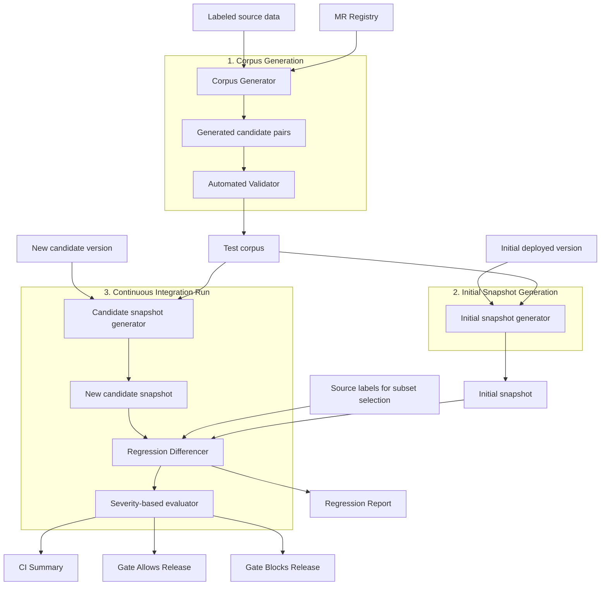
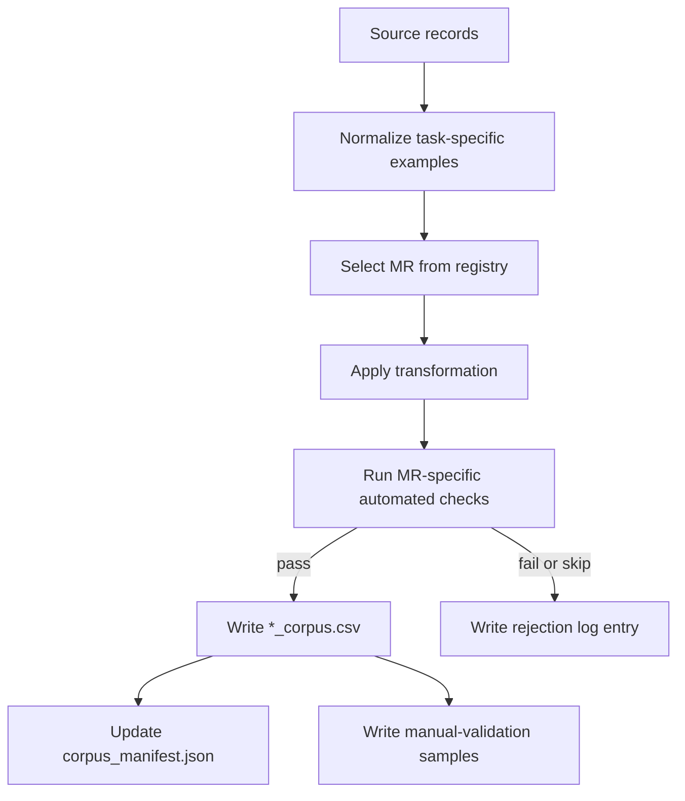
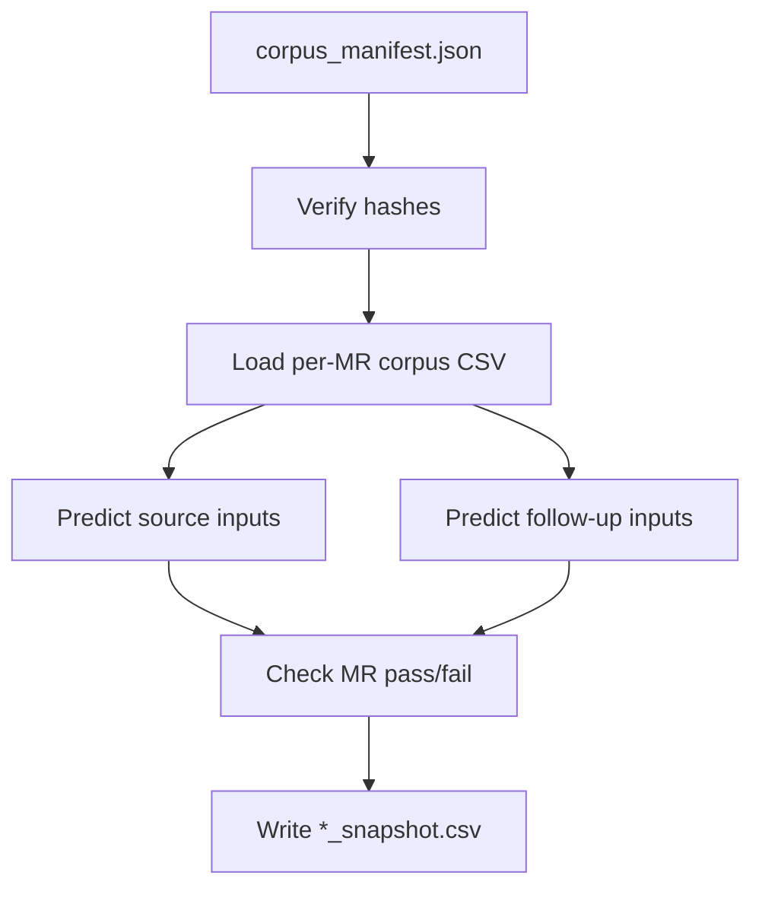
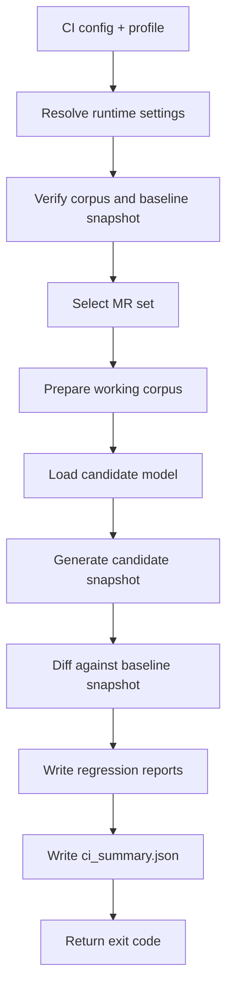

# Alteron Architecture

## System Overview

Alteron is a behavioral regression testing tool for NLP classifiers. Its purpose is to compare an accepted model version with a newer candidate version and determine whether the update introduced behavioral regressions that standard aggregate metrics may not reveal.

At a high level, Alteron has three operational stages:

1. **Corpus generation** from labeled source examples and selected metamorphic relations
2. **Snapshot generation** for a model version on that fixed corpus
3. **CI regression checking** that compares a candidate snapshot against a stored baseline snapshot

The tool is organized around these stages and keeps the public interface narrow:

- `alteron corpus generate`
- `alteron snapshot baseline`
- `alteron snapshot create`
- `alteron-ci`

## Architecture Overview

The diagram below is the rendered version of the original architecture PDF:

The same workflow is reproduced below in Mermaid form so it stays editable in the repository:

## Repository Layout

The main architecture lives under [alteron](/Users/shazzad/Desktop/Codespace/chrysalis/alteron):

| Path | Purpose |
|---|---|
| [alteron/cli.py](/Users/shazzad/Desktop/Codespace/chrysalis/alteron/cli.py) | Main CLI for corpus and snapshot commands |
| [alteron/ci/runner.py](/Users/shazzad/Desktop/Codespace/chrysalis/alteron/ci/runner.py) | CI runner for version-to-version checks |
| [alteron/corpus/](/Users/shazzad/Desktop/Codespace/chrysalis/alteron/corpus) | Corpus generation, validation, and schemas |
| [alteron/snapshot/](/Users/shazzad/Desktop/Codespace/chrysalis/alteron/snapshot) | Snapshot creation and corpus hash verification |
| [alteron/regression/](/Users/shazzad/Desktop/Codespace/chrysalis/alteron/regression) | Matched-subset differencing and report writing |
| [alteron/registry/](/Users/shazzad/Desktop/Codespace/chrysalis/alteron/registry) | MR registry loading and metadata |
| [alteron/mrs/](/Users/shazzad/Desktop/Codespace/chrysalis/alteron/mrs) | Metamorphic relation implementations |

## Core Components

### 1. CLI Layer

The CLI layer is split across two entry points.

#### `alteron`

Implemented in [alteron/cli.py](/Users/shazzad/Desktop/Codespace/chrysalis/alteron/cli.py), this command owns:

- corpus generation
- baseline snapshot generation
- generic snapshot creation

It is config-aware and can read:

- top-level `corpus` settings
- top-level `snapshot` settings

#### `alteron-ci`

Implemented in [alteron/ci/runner.py](/Users/shazzad/Desktop/Codespace/chrysalis/alteron/ci/runner.py), this command owns:

- CI profile selection
- runtime path resolution
- candidate snapshot generation
- baseline versus candidate differencing
- CI summary and report writing

It reads:

- top-level `run` settings
- top-level `profiles`
- optional top-level `seed`
- optional top-level `regression_threshold`

### 2. MR Registry

The MR registry is the metadata backbone of Alteron.

Files:

- [alteron/registry/mr_registry.yaml](/Users/shazzad/Desktop/Codespace/chrysalis/alteron/registry/mr_registry.yaml)
- [alteron/registry/registry.py](/Users/shazzad/Desktop/Codespace/chrysalis/alteron/registry/registry.py)

The registry defines, per MR:

- MR identifier
- subtask applicability
- relation type
- expected behavior
- severity
- implementation module

Architecturally, the registry allows the rest of the tool to stay generic. Corpus generation, snapshotting, and differencing can operate on registry-driven MR selections instead of hardcoded task flows.

### 3. Corpus Generator

The corpus generation stage is implemented primarily in:

- [alteron/corpus/generator.py](/Users/shazzad/Desktop/Codespace/chrysalis/alteron/corpus/generator.py)
- [alteron/corpus/validator.py](/Users/shazzad/Desktop/Codespace/chrysalis/alteron/corpus/validator.py)
- [alteron/corpus/schemas.py](/Users/shazzad/Desktop/Codespace/chrysalis/alteron/corpus/schemas.py)

Responsibilities:

- normalize source examples from `.csv`, `.json`, or `.jsonl`
- instantiate MR implementations from the registry
- apply transformations per eligible source example
- validate transformed pairs with MR-specific checks
- write fixed corpus CSVs
- write `corpus_manifest.json`
- write manual-validation samples
- write a rejection log

The design choice here is important: corpus generation happens once, ahead of CI checks. That means later version comparisons are made on the same frozen transformed inputs.

### 4. Snapshot Engine

The snapshot stage is implemented in [alteron/snapshot/engine.py](/Users/shazzad/Desktop/Codespace/chrysalis/alteron/snapshot/engine.py).

Responsibilities:

- verify corpus hashes before inference
- load each per-MR corpus file
- run source and follow-up inference
- compute MR pass/fail using the MR implementation
- record per-example behavioral outcomes as snapshot CSVs

The snapshot engine accepts flexible model interfaces:

- `model.predict_many(...)`
- `model.predict(...)`
- a directly callable model object

This keeps the tool compatible with simple wrappers as well as richer model bundles.

### 5. Regression Differ

The differ is implemented in [alteron/regression/differ.py](/Users/shazzad/Desktop/Codespace/chrysalis/alteron/regression/differ.py).

Responsibilities:

- compare baseline and candidate snapshots for one MR
- compute source-side accuracy changes
- build the matched subset
- compute pass-rate deltas on that matched subset
- flag behavioral regressions under the configured threshold
- write standard and fairness reports

The matched-subset design is the core statistical choice in Alteron. It avoids conflating general source-side misclassification changes with MR pass-rate changes on inputs both versions classified correctly at the source level.

### 6. CI Runner

The CI orchestration layer is implemented in [alteron/ci/runner.py](/Users/shazzad/Desktop/Codespace/chrysalis/alteron/ci/runner.py).

Responsibilities:

- load the CI configuration and selected profile
- verify the candidate model directory and baseline snapshot directory
- select the MR set for the run
- optionally sample a working corpus per MR
- create the candidate snapshot
- run differencing against the baseline snapshot
- write `ci_summary.json`
- return a blocking or non-blocking exit code

The CI runner is the layer that converts per-MR behavioral outcomes into a release decision.

## Component Interaction

```mermaid
flowchart LR
    subgraph CorpusStage["Corpus Stage"]
        C1["Normalize source data"]
        C2["Apply MR transformations"]
        C3["Run validation checks"]
        C4["Write corpus artifacts"]
    end

    subgraph SnapshotStage["Snapshot Stage"]
        S1["Verify corpus manifest"]
        S2["Run model inference"]
        S3["Evaluate MR pass/fail"]
        S4["Write snapshot CSVs"]
    end

    subgraph CIStage["CI Stage"]
        I1["Load CI profile"]
        I2["Prepare working corpus"]
        I3["Create candidate snapshot"]
        I4["Diff against baseline"]
        I5["Write CI outputs"]
    end

    C1 --> C2 --> C3 --> C4
    C4 --> S1 --> S2 --> S3 --> S4
    S4 --> I1 --> I2 --> I3 --> I4 --> I5
```

## Data Flow

### Corpus Generation Flow

Important architectural properties:

- corpus records are serialized uniformly through [alteron/corpus/schemas.py](/Users/shazzad/Desktop/Codespace/chrysalis/alteron/corpus/schemas.py)
- the manifest hashes each corpus file
- validation is explicit rather than implicit in the MR implementation

### Snapshot Flow

A notable implementation detail is source-prediction caching inside the snapshot engine. When repeated corpus rows share the same source text, Alteron avoids redundant source-side inference.

### CI Flow

This separation matters:

- `alteron snapshot baseline` creates the reference snapshot once
- `alteron-ci` regenerates the candidate snapshot for the current version under test

## Artifact Model

Alteron’s architecture is artifact-driven. The most important persisted outputs are:

| Artifact | Produced by | Purpose |
|---|---|---|
| `*_corpus.csv` | Corpus generator | Frozen transformed test inputs |
| `corpus_manifest.json` | Corpus generator | Integrity verification for later runs |
| `manual_validation_artifacts_*.csv` | Corpus generator | Human review samples |
| `*_snapshot.csv` | Snapshot engine | Per-version behavioral records |
| `regression_report_<transition>.csv` | Regression differ / CI runner | Standard MR-level regression diagnostics |
| `fairness_regression_report_<transition>.csv` | Regression differ / CI runner | Fairness-only alerts |
| `ci_summary.json` | CI runner | Machine-readable CI outcome |

## Public Data Schemas

The tool serializes three main record types.

### Corpus record

Defined in [alteron/corpus/schemas.py](/Users/shazzad/Desktop/Codespace/chrysalis/alteron/corpus/schemas.py):

- `mr_id`
- `input_id`
- `subtask`
- `source_text`
- `source_label`
- `followup_text`
- `expected_output_relation`
- `variant`
- `skip_reason`

### Snapshot record

Defined in [alteron/corpus/schemas.py](/Users/shazzad/Desktop/Codespace/chrysalis/alteron/corpus/schemas.py):

- `model_version`
- `mr_id`
- `input_id`
- `variant`
- `source_pred_label`
- `source_pred_score`
- `followup_pred_label`
- `followup_pred_score`
- `mr_pass`
- `fairness_regression`
- `timestamp`

### Regression report row

Defined in [alteron/regression/differ.py](/Users/shazzad/Desktop/Codespace/chrysalis/alteron/regression/differ.py):

- `transition`
- `mr_id`
- `n_total`
- `source_accuracy_old`
- `source_accuracy_new`
- `source_accuracy_delta`
- `n_matched`
- `pass_rate_old`
- `pass_rate_new`
- `matched_pass_rate_delta`
- `behavioral_regression_flag`
- `pipeline_severity`
- `release_blocked`

## Severity Routing

Severity comes from the MR registry and is interpreted by the CI profile.

Current behavior:

- `hard-fail` can block a run
- `soft-warning` is reported but does not block unless the profile explicitly asks for it
- fairness regressions are counted separately and written into a separate fairness report

This is how Alteron separates release blocking from fairness monitoring without losing either signal.

## Configuration Architecture

Alteron uses a single YAML-first configuration model with four operational sections:

- `corpus`
- `snapshot`
- `run`
- `profiles`

The canonical example is [alteron.example.yml](/Users/shazzad/Desktop/Codespace/chrysalis/alteron.example.yml).

The split is intentional:

- `corpus` and `snapshot` configure preparation stages
- `run` and `profiles` configure the CI stage

This makes it possible to reuse a single config across all stages while still separating baseline preparation from candidate evaluation.

## Extensibility Points

The main architectural extension points are:

### 1. New metamorphic relations

To add a new MR:

1. implement the MR module under [alteron/mrs/](/Users/shazzad/Desktop/Codespace/chrysalis/alteron/mrs)
2. register it in [alteron/registry/mr_registry.yaml](/Users/shazzad/Desktop/Codespace/chrysalis/alteron/registry/mr_registry.yaml)
3. ensure validator and tests cover its behavior

### 2. New model wrappers

To support a new model family:

1. provide a loader function matching the documented loader contract
2. ensure predictions resolve to label-score pairs
3. ensure the tokenizer behavior is appropriate for any selected MRs

### 3. New CI profiles

Add a new profile under `profiles` in the config:

- choose the MR set
- choose optional sampling limits
- choose blocking severities
- optionally override the regression threshold

## Design Decisions

Several design decisions shape the current architecture:

### Frozen corpus design

The corpus is generated once and then reused. This keeps the version comparison stable and makes later differences attributable to model behavior rather than changing test data.

### Matched-subset differencing

Regression detection operates on the subset of examples whose source inputs both versions classify correctly. This is the main mechanism for isolating behavioral regressions from general source-side accuracy shifts.

### Artifact-first CI

The CI runner writes explicit machine-readable artifacts instead of only printing terminal output. That makes Alteron easier to integrate into release workflows and easier to inspect after failure.

### Registry-driven MR selection

The tool does not hardcode per-MR CI policy in the runner. Instead, severity and metadata live in the registry, while the CI profile decides which severities are blocking.

## Technology Stack

| Component | Technology | Purpose |
|---|---|---|
| Language | Python 3.10+ | Core implementation |
| Config format | YAML | User-facing configuration |
| NLP parsing | spaCy | POS and dependency-aware MR logic |
| Lexical filtering | NLTK words corpus | Keyboard-typo collision checks |
| Testing | pytest | Unit and integration testing |

## Related Documents

- [README.md](/Users/shazzad/Desktop/Codespace/chrysalis/README.md)
- [USER_MANUL.md](/Users/shazzad/Desktop/Codespace/chrysalis/USER_MANUL.md)
- [API_REFERENCE.md](/Users/shazzad/Desktop/Codespace/chrysalis/API_REFERENCE.md)
- [alteron.example.yml](/Users/shazzad/Desktop/Codespace/chrysalis/alteron.example.yml)
- [alteron/architecture.pdf](/Users/shazzad/Desktop/Codespace/chrysalis/alteron/architecture.pdf)
